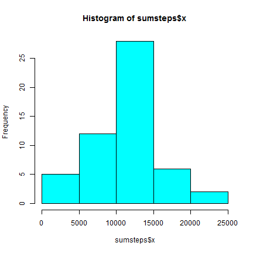
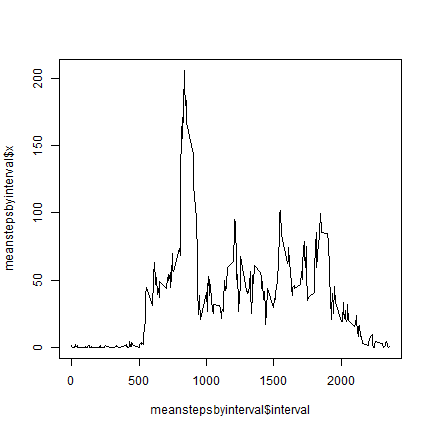
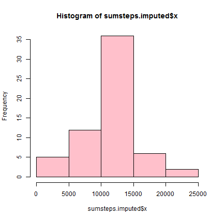
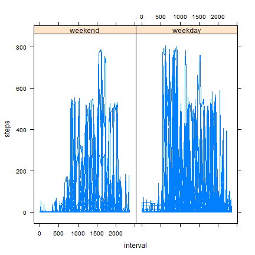

# Reproducible Research: Peer Assessment 1


## Loading and preprocessing the data

```r
unzip("activity.zip", "activity.csv")
data <- read.csv("activity.csv")
data <- transform(data, date = as.Date(date))
```


## What is mean total number of steps taken per day?

```r
sumsteps <- aggregate(data$steps, list(date = data$date), sum)
hist(sumsteps$x, col = "cyan")
```

 

```r
summary(sumsteps$x)[c("Median", "Mean")]
```

```
## Median   Mean 
##  10800  10800
```


## What is the average daily activity pattern?

```r
meanstepsbyinterval <- aggregate(data$steps, list(interval = data$interval), 
    mean, na.rm = T)
plot(meanstepsbyinterval$interval, meanstepsbyinterval$x, type = "l")
```

 


Interval with most steps: 

```r
meanstepsbyinterval[meanstepsbyinterval$x == max(meanstepsbyinterval$x), "interval"]
```

```
## [1] 835
```


## Imputing missing values
Total number of rows with NAs: 

```r
sum(is.na(data$steps))
```

```
## [1] 2304
```


We will supply the missing values by filling them in from the interval averages.

```r
data.imputed <- data
for (i in which(is.na(data.imputed$steps))) {
    interval <- data.imputed$interval[i]
    impute <- meanstepsbyinterval[meanstepsbyinterval$interval == interval, 
        "x"]
    data.imputed$steps[i] <- impute
}
```


```r
sumsteps.imputed <- aggregate(data.imputed$steps, list(date = data.imputed$date), 
    sum)
hist(sumsteps.imputed$x, col = "pink")
```

 

```r
summary(sumsteps.imputed$x)[c("Median", "Mean")]
```

```
## Median   Mean 
##  10800  10800
```


## Are there differences in activity patterns between weekdays and weekends?

```r
data.imputed$weekday <- weekdays(data.imputed$date)
data.imputed$weekday.type <- factor(lapply(data.imputed$weekday, function(day) {
    if (day == "Saturday" || day == "Sunday") {
        "weekend"
    } else {
        "weekday"
    }
}), c("weekend", "weekday"))

library(lattice)
xyplot(steps ~ interval | weekday.type, data = data.imputed, type = "l")
```

 


